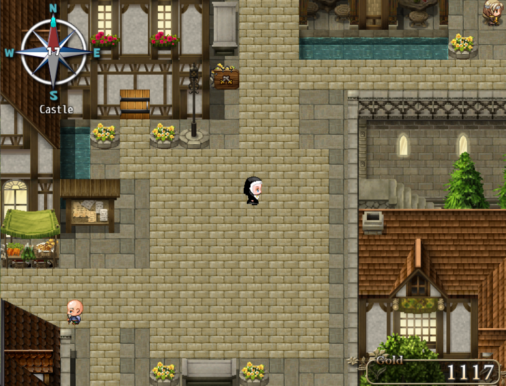
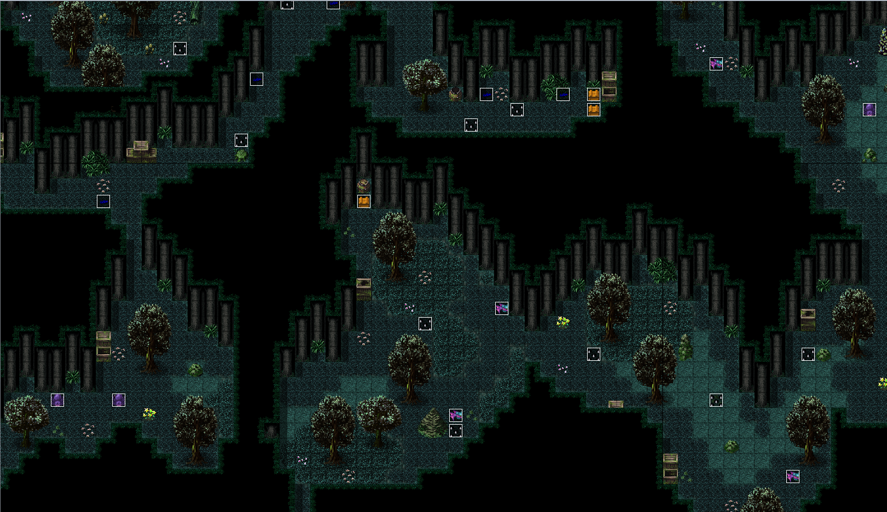
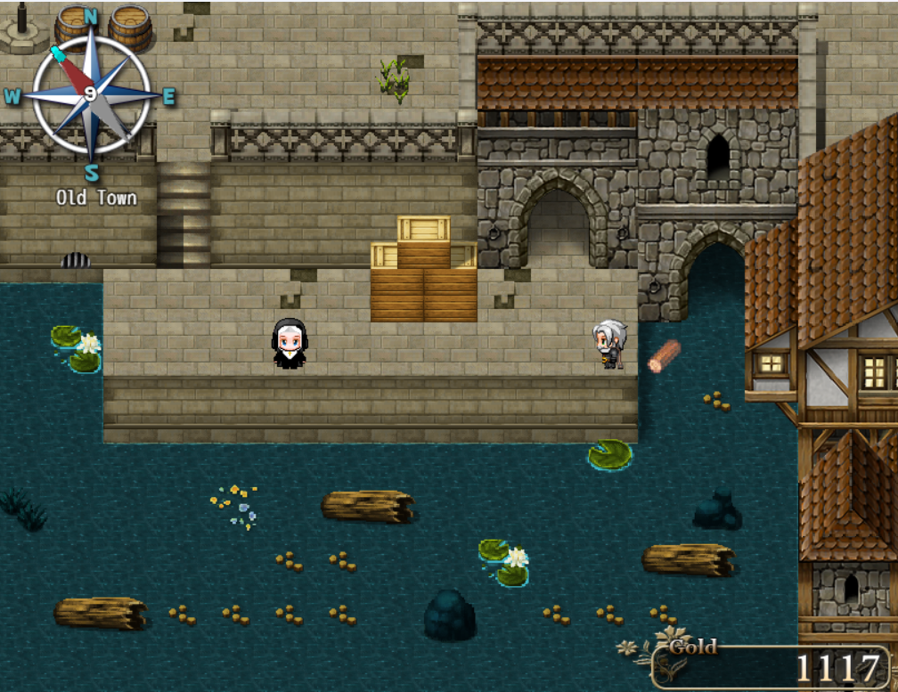
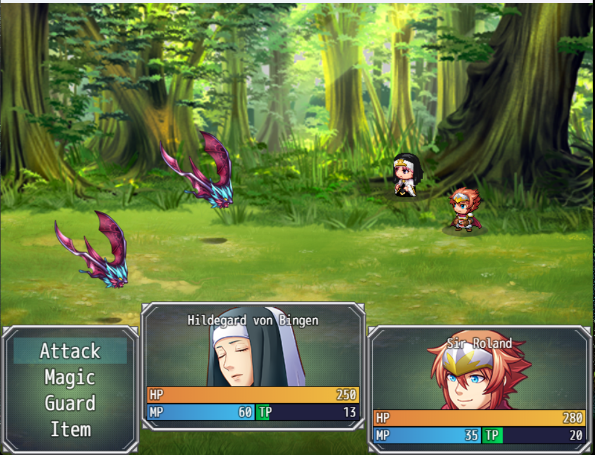

# Echoes of the Sacred Waters

**A 2D Historical Fantasy RPG developed using RPG Maker MV**

## Overview

**Echoes of the Sacred Waters** is a story-driven 2D historical fantasy RPG inspired by the life of the historical figure **Hildegard von Bingen (1098–1179)**, a visionary polymath renowned for her contributions to herbal medicine, philosophy, music, and spiritual writings.

Set in **12th-century Germany**, the game takes players on an immersive adventure through a medieval world filled with political conflict, ancient waterways, herbal knowledge, and moral choices that shape the future of society.

Unlike traditional RPG Maker games that focus primarily on combat, this project emphasizes **exploration, puzzle-solving, diplomacy, storytelling, and educational historical elements** within a narrative-driven experience.

---

## Story

Players take control of **Hildegard von Bingen**, a gifted herbal healer and visionary woman entrusted with delivering medicinal supplies to merchants in a nearby city.

What begins as a simple mission gradually evolves into a larger political and social conflict involving the city's **sacred canal system**, a structure that divides social classes and determines the prosperity of the region.

Throughout the journey, players will:

- Gather herbal ingredients
- Explore forests and medieval settlements
- Solve canal engineering puzzles
- Battle dangerous wild creatures
- Interact with merchants and political figures
- Make meaningful dialogue choices that shape the story

Every decision made by the player influences the narrative and leads to **multiple possible endings**.

---

## Features

- Historical fantasy setting inspired by real medieval history
- Story-driven gameplay with immersive worldbuilding
- Branching dialogue and decision-making system
- Multiple endings based on player choices
- Herbal crafting and healing system
- Exploration-focused progression
- Puzzle-solving mechanics
- Turn-based RPG battle system
- Medieval-themed environments and atmosphere

---

## Gameplay Mechanics

### Herbal Gathering
Players collect medicinal plants and natural ingredients across forests and wheat fields to craft healing potions and remedies.

### Canal Puzzle System
Players must repair and reactivate ancient canal systems through mechanical puzzles located in underground waterways.

### Battle System
Hostile creatures encountered during exploration can be fought using a classic **party-based turn-based combat system**.

### Dialogue Choices
Major story decisions influence political outcomes, character relationships, and determine the ending players receive.

---

## Main Characters

### Hildegard von Bingen
The protagonist of the story — a visionary herbal healer determined to restore the sacred canal and help the people of the city.

### Jutta von Sponheim
Hildegard’s mentor who introduces her to herbal medicine, discipline, and spiritual understanding.

### Sir Roland von Harburg
A former knight turned mercenary who accompanies Hildegard during dangerous expeditions into the Dark Forest.

### Alaric
A talented engineer specializing in mechanical systems, gears, and canal infrastructure.

### Markus Feldmann
A pragmatic merchant with ambitious economic plans for the city.

### Sir Karl
The respected leader of the Merchant Guild whose decisions greatly influence the city’s future.

---

## Enemies

Players will encounter various hostile creatures during exploration:

- Lion
- Spider
- Rat
- Snake
- Bat

---

## Maps and Locations

The game world contains multiple explorable locations, including:

- Old Town
- Village
- Wheat Fields
- Castle Gate
- Main Forest
- Dark Forest
- Canal Tunnel
- Merchant Guild Office
- Merchant Shop

---

## Technologies Used

### Game Engine
- **RPG Maker MV**

### Plugins
This project utilizes several RPG Maker MV plugins, including:

- YEP_BattleEngineCore
- YEP_MessageCore
- GALV_VisibilityRange
- MOG_TitleSplashScreen
- MOG_Weather_EX
- MOG_MenuBackground
- MOG_SceneMenu
- MOG_SceneStatus
- MOG_TimeSystem_Hud
- And many more

---

## Educational Value

This project was designed not only as entertainment but also as an **interactive historical learning experience**.

Topics explored in the game include:

- Medieval history
- Herbal medicine
- Social class conflict
- Water management systems
- Women's contributions to science and spirituality during the Middle Ages

---

## Screenshots

### Village Area

### Dark Forest

### Canal Puzzle

### Battle System

---

## Platform

- **Windows PC**

---

## Developer

**Muhammad Isyan Maulana**

---

## Project Status

✅ **Completed Academic Game Project**
